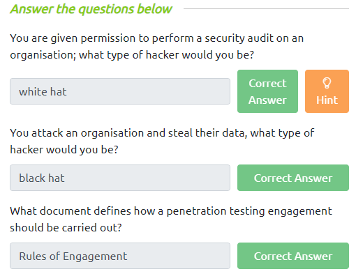
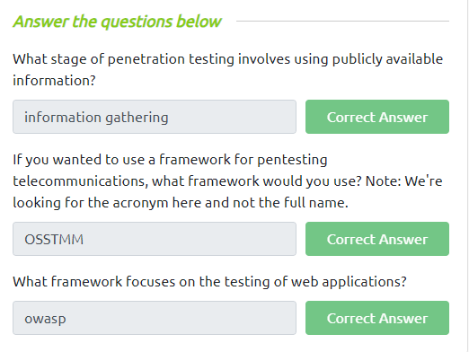

# Pentesting Fundamentals

**What is Penetration Testing?**

---

Antes de aprender as técnicas práticas de hacking ético, você precisa entender as responsabilidades de um pentester e os processos usados em testes de penetração (pentests). Pentests buscam vulnerabilidades em sistemas e aplicações de clientes.

A cibersegurança é cada vez mais importante e relevante em todos os setores. Invasões e vazamentos de dados se tornam frequentes.

Seja para proteger e-mails com senhas fortes ou para resguardar dados e dispositivos de empresas, a cibersegurança é fundamental no mundo moderno.

Um pentest é uma tentativa ética de testar e analisar as defesas de segurança que protegem informações e ativos. Ele utiliza as mesmas ferramentas, técnicas e metodologias que um invasor malicioso usaria, similar a uma auditoria.

**Penetration Testing Ethics**

---

O debate entre ética e legalidade na cibersegurança, e principalmente em testes de penetração, é sempre polêmico. Graças a alguns "malfeitores", termos como "hacker" e "hackear" possuem uma conotação negativa na cultura pop. A ideia de acessar legalmente um sistema de computador é difícil de entender - afinal, o que torna isso legal?

Um teste de penetração é uma auditoria autorizada dos sistemas de segurança de um computador, com o aval de seus proprietários. A legalidade da penetração é clara nesse contexto. Qualquer ação fora desse acordo é considerada não autorizada.

Antes do teste, há uma discussão formal entre o pentester (quem realiza o teste) e o dono do sistema. São acordadas as ferramentas, técnicas e sistemas a serem testados. Esta discussão define o escopo do teste e direciona sua execução.

Empresas de pentest seguem regras legais e certificações. Por exemplo, o National Cyber Security Centre (NCSC) do Reino Unido possui o programa CHECK. Esse programa garante que "somente empresas aprovadas pelo CHECK podem conduzir testes de penetração autorizados em sistemas e redes do setor público".

A ética é o debate moral entre o certo e o errado. Uma ação legal pode ir contra o sistema de crenças individual.

Pen testers podem enfrentar dilemas éticos durante um teste. Por exemplo, ao acessar um banco de dados com informações sensíveis, ou realizar um ataque de phishing para testar a segurança humana da empresa. Se essas ações foram acordadas inicialmente, são legais, mas eticamente questionáveis.

No mundo da cibersegurança, categorizamos hackers por suas motivações e métodos. Esses termos - chapéu branco (white hat), chapéu cinza (gray hat) e chapéu preto (black hat) - servem para diferenciá-los.

**Hackers do bem: Chapéu Branco (White Hat)**

- Agem de forma legal e ética.
- Utilizam seus conhecimentos para identificar vulnerabilidades em sistemas de computadores e redes, mas com a autorização dos proprietários.
- Seu objetivo é ajudar as organizações a corrigirem falhas de segurança e se previnirem de ataques cibernéticos.
- Também conhecidos como hackers éticos ou ethical hackers, eles desempenham um papel fundamental na manutenção da segurança digital.

**Uma zona cinzenta: Chapéu Cinza (Gray Hat)**

- Habitam uma área intermediária.
- Podem usar seus conhecimentos para fins positivos, como descobrir vulnerabilidades, mas sem necessariamente comunicá-las aos responsáveis pelo sistema vulnerável.
- Às vezes, divulgam publicamente as falhas encontradas, o que pode ser útil para aumentar a conscientização sobre segurança, mas também pode ser explorado por criminosos.
- Suas ações podem ser consideradas irresponsáveis ou antiéticas.

**Hackers do mal: Chapéu Preto (Black Hat)**

- Agem de forma ilegal e maliciosa.
- Invadem sistemas de computadores e redes sem autorização para roubar dados, causar estragos ou prejudicar a reputação das vítimas.
- Podem usar seus conhecimentos para espalhar malware, realizar ataques cibernéticos e lucrar com atividades criminosas.
- Representam uma grande ameaça à segurança digital.

Para resumir, os hackers do chapéu branco são os mocinhos do mundo digital, ajudando a proteger sistemas de ataques. Os chapéus cinza operam em uma zona incerta, e os chapéus pretos são os vilões, causando danos e roubando informações.

**Rules of Engagement (ROE)**

---

É um documento criado no inicio do trabalho do pentest, esse documento consiste em 3 seções

| Seção           | Descrição                                                                                                                                                                                                                                              |
| --------------- | ------------------------------------------------------------------------------------------------------------------------------------------------------------------------------------------------------------------------------------------------------ |
| Permissão       | Esta seção do documento dá permissão explícita para que o trabalho seja realizado. Esta permissão é essencial para proteger legalmente indivíduos e organizações pelas atividades que realizam.                                                        |
| Escopo do teste | Esta seção do documento irá anotar metas específicas às quais o compromisso deve ser aplicado. Por exemplo, o teste de penetração pode aplicar-se apenas a determinados servidores ou aplicações, mas não a toda a rede.                               |
| Regras          | A seção de regras definirá exatamente as técnicas permitidas durante o engajamento. Por exemplo, as regras podem estabelecer especificamente que técnicas como ataques de phishing são proibidas, mas ataques MITM (Man-in-the-Middle) são aceitáveis. |

**Penetration Testing Methodologies**

---

Testes de penetração possuem objetivos e alvos diversos. Por isso, não existe um padrão único para conduzi-los. A forma como um profissional de pentest irá realizá-lo depende do contexto específico.

As etapas seguidas por um pentester durante o trabalho são chamadas de metodologia. Uma metodologia prática é aquela que se adapta à situação. Por exemplo, a metodologia usada para testar a segurança de uma aplicação web não é aplicável para testar a segurança de uma rede.

Antes de discutirmos algumas metodologias padrão da indústria, é importante observar que todas elas compartilham um tema geral, dividido nas seguintes etapas:

| Fase                  | Descição                                                                                                                                                                                                                                                                                                                                                                                              |
| --------------------- | ----------------------------------------------------------------------------------------------------------------------------------------------------------------------------------------------------------------------------------------------------------------------------------------------------------------------------------------------------------------------------------------------------- |
| Information Gathering | Esta fase envolve a recolha do máximo possível de informações publicamente acessíveis sobre um alvo/organização, por exemplo, OSINT e investigação. _Nota: Isso não envolve a verificação de nenhum sistema._                                                                                                                                                                                         |
| Enumeration/Scanning  | Esta etapa envolve a descoberta de aplicativos e serviços em execução nos sistemas. Por exemplo, encontrar um servidor web que possa ser potencialmente vulnerável.                                                                                                                                                                                                                                   |
| Exploitation          | Este estágio envolve aproveitar as vulnerabilidades descobertas em um sistema ou aplicativo. Este estágio pode envolver o uso de explorações públicas ou a exploração da lógica do aplicativo.                                                                                                                                                                                                        |
| Privilege Escalation  | Depois de explorar com sucesso um sistema ou aplicativo (conhecido como ponto de apoio), este estágio é a tentativa de expandir seu acesso a um sistema. Você pode escalar horizontalmente e verticalmente, onde horizontalmente está acessando outra conta do mesmo grupo de permissão (ou seja, outro usuário), enquanto verticalmente é o de outro grupo de permissão (ou seja, um administrador). |
| Post-exploitation     | Esta etapa envolve algumas subetapas: **1.** Quais outros hosts podem ser direcionados (dinamização) **2.** Que informações adicionais podemos coletar do host agora que somos um usuário privilegiado **3.** Cobrindo seus rastros **4.** Relatórios.                                                                                                                                                |

Existem alguns frameworks cada um voltado para uma área.

- OSSTMM
- OWASP
- NIST Cybersecurity Framework 1.1
- NCSC CAF

**Black box, White box, Grey box Penetration Testing**

---

- **Black-box testing:** Esse é o tipo de teste mais parecido com uma invasão real, nesse tipo de teste o hacker não tem nenhum conhecimento sobre a infra do alvo, sendo assim necessário um esforço muito maior na etapa de information gathering.

- **Gray-box testing:** Esse tipo de teste fica no meio termo, o hacker tem algum conhecimento da infra do alvo, reduzindo assim o tempo de reconhecimento e se concentrando na superfície de ataque.

- **White-box testing:** Esse tipo de teste o hacker tem acesso total ao sistema/rede do alvo podendo assim testar toda a rede.

