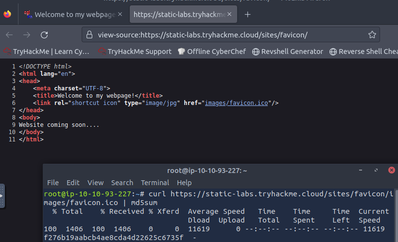
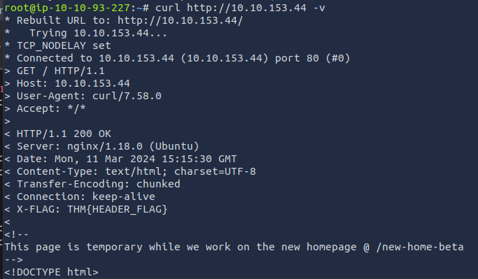

## What Is Content Discovery?

---

Content discovery é a descoberta de qualquer recurso que não deveria esta aberta na internet para todos, recursos como: paines de configuração, backups, versões antigas do site etc.

Podemos procurar essas informações de forma manual, automática ou framework OSINT(OPEN-SOURCE Inteligence).

## Manual Discovery - Robots.txt

---

O arquivo robots.txt é um documento que informa aos mecanismos de pesquisa quais páginas eles podem ou não ser exibidos nos resultados de seus mecanismos de pesquisa.

## Manual Discovery - Favicon

---

O favicon é um pequeno ícone exibido na barra de endereço ou guia do navegador usado para marcar um site.

Esse favicon se torna importante pois, geralmente desenvolvedores utilizam frameworks para criarem o sistema, caso o favicon não tenha sido alterado pelo desenvolvedor podemos verificar o favicon assim podendo encontrar qual framework e versão está sendo usado.

https://wiki.owasp.org/index.php/OWASP_favicon_database.

## Manual Discovery - Sitemap.xml

---

Esse arquivo é é literalmente oq o nome dele sugere, através desse arquivo podemos ver o mapa do site, os mecanismos de busca tb se orientam por esse arquivo para listar as paginas no resultado de busca.

## Manual Discovery - HTTP Headers

---

Os cabeçalhos de requisição podem ter informações uteis sobre como o sistema funciona, qual software esta rodando qual versão etc.

## Manual Discovery - Framework Stack

---

Podemos procurar arquivos que denuncie qual framework esta sendo utilizado, como os favicons, saber sobre um framework é importante pois podemos pesquisar sua documentação e entender um pouco mais de como a tecnologia funciona, alem de que sabendo a versão podemos pesquisar pro exploits publicos.

## OSINT - Google Hacking / Dorking

---

O google dork é um conjunto de ferramenta de pesquisa avançada que nos possibilita uma "filtro" muito mais preciso em nossas buscas.

| Filtro   | Exemplo            | Descrição                                                      |
| -------- | ------------------ | -------------------------------------------------------------- |
| site     | site:tryhackme.com | retorna apenas resultados que possui o endereço solicitado.    |
| inurl    | inurl:admin        | retorna apenas paginas que tem o argumento admin na URL.       |
| filetype | filetype:pdf       | retorna resultados que são uma extensão de arquivo específico. |
| intitle  | intitle:admin      | retorna resultados que contêm a palavra especificada no título |

## OSINT - Wappalyzer

---

Wappalyzer é uma extensão de navegador que pode verificar o site acessado retornando as tecnologias usadas.

https://www.wappalyzer.com/

## OSINT - Wayback Machine

---

Atraves do site https://archive.org/web/ temos acesso a aplicação walbackmachine, nela podemos ver versões antigas de um mesmo endereço.

## OSINT - GitHub

---

Github é como se fosse uma 'rede social' de codigo, utilizamos o GIT que é um sistema de controle de versão.
muitos programadores usam o github ou similares para trabalhar em equipe, por isso é uma boa ideia verificar os repositorios dos sistemas alvo.

## OSINT - S3 Buckets

---

Esse é o serviço de armazenamento da amazon, a má configuração desse produto pode resultar em exposição de informações que não deveriam ser publicas.

O formato dos buckets S3 é https://{name}.s3.amazonaws.com onde {name} é decidido pelo proprietário, como tryhackme-assets.s3.amazonaws.com. Os buckets S3 podem ser descobertos de várias maneiras, como encontrar URLs na origem da página do site, repositórios GitHub ou até mesmo automatizar o processo. Um método de automação comum é usar o nome da empresa seguido de termos comuns como {nome}-ativos, {nome}-www, {nome}-público, {nome}-privado, etc.

## Automated Discovery

---
