## Introdução

---

Vamos conhecer a vuln podendo ser Local File Inclusion (LFI), Remote File Inclusion (RFI) e directory traversal. basicamente o LFI permite ler arquivos do servidor e o RFI permite subir um arquivo para o servidor alvo, esse sendo bem mais impactante.

Em alguns sistemas eles são escritos para solicitar acesso a arquivos por meio de Query Parameters

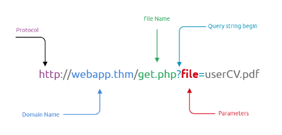

É importante sempre não confiar no que o usuario envia, e sanitizar e validar tudo que vem de fora do seu sistema, se não cuidada pode ocorrer vazamentos de dados e caso o invasor consiga escrever dados ai ja era... o atacante pode incluir um RCE no sistema e ter controle total.

## Path Traversal

---

Essa vuln permite que um atacante possa ler arquivos, basicamente mudando o valor do caminho do arquivo um sistema mal configurado vai retornar o mesmo.

No PHP essa vuln é bem conhecida, a função file_get_contents possibilita o ataque se não for devidamente tratado, além de funções como include, require, include_once, and require_once.

https://www.php.net/manual/en/function.file-get-contents.php

Alguns caminhos interessantes de se testar:

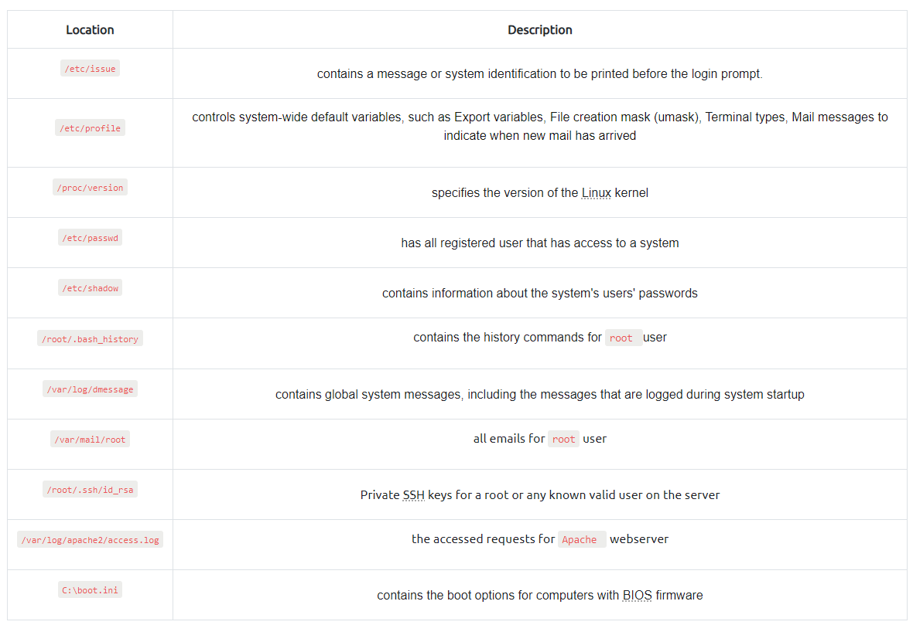

## Local File Inclusion - LFI

---

- **Lab 1**

---

- **Lab 2**

---

---

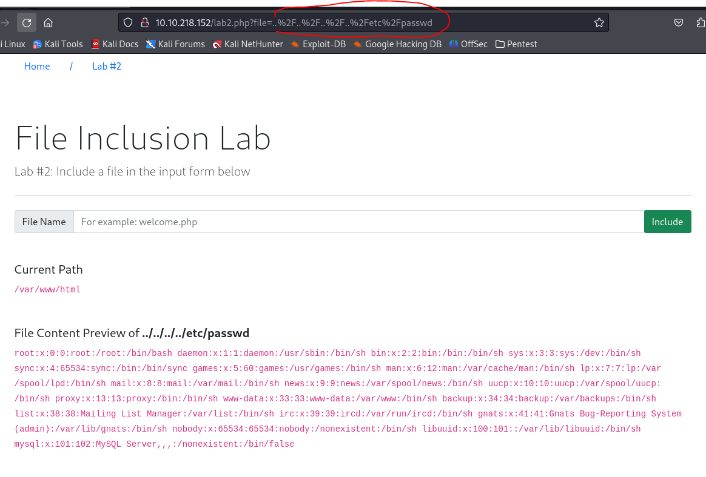

- **Lab 3**

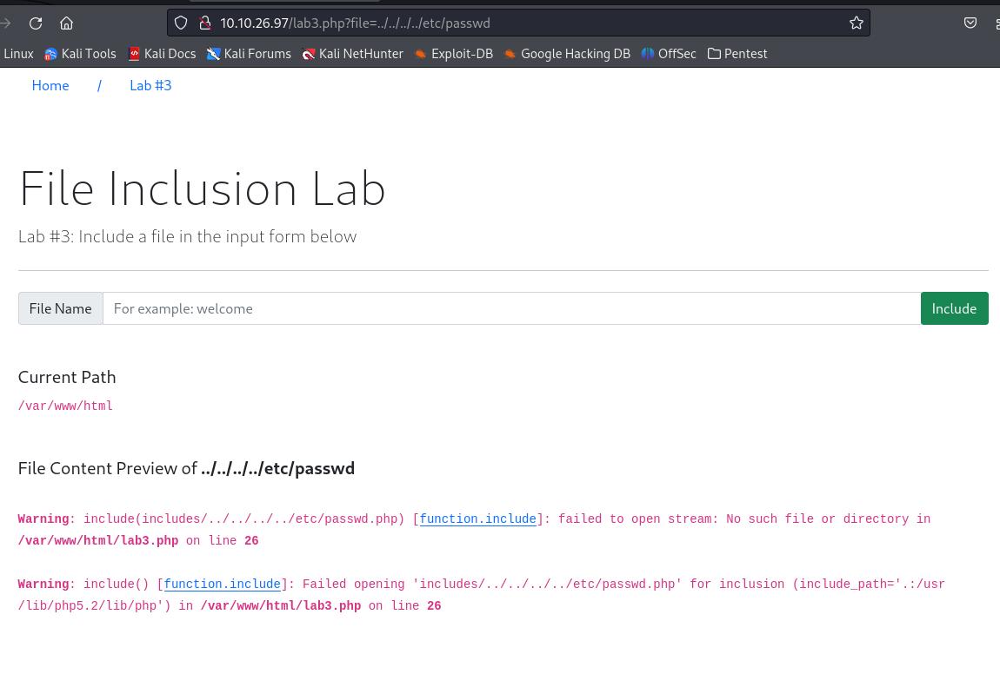

---

- **Lab 4**

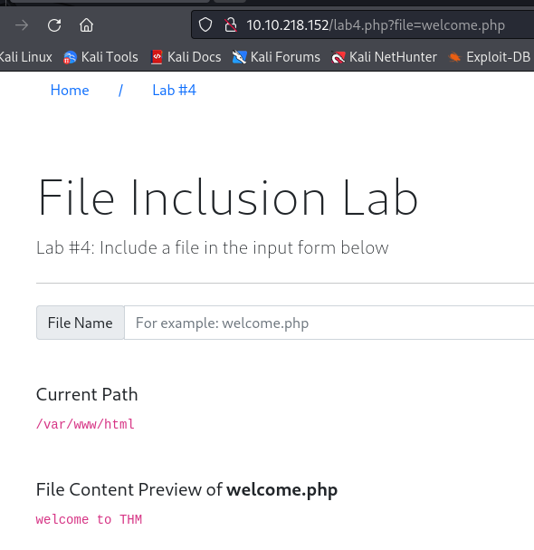

---

---

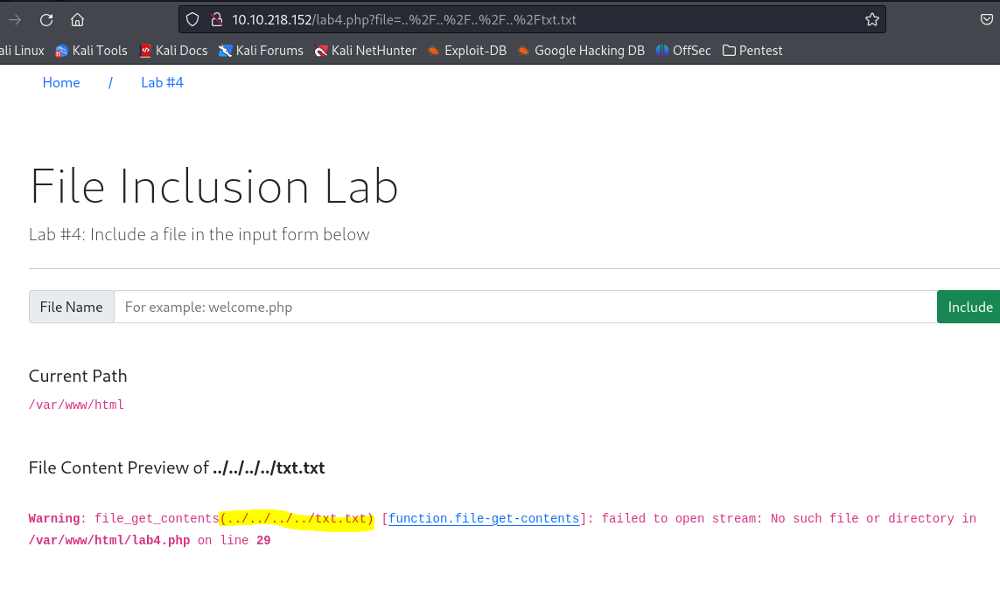

---

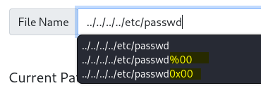

---

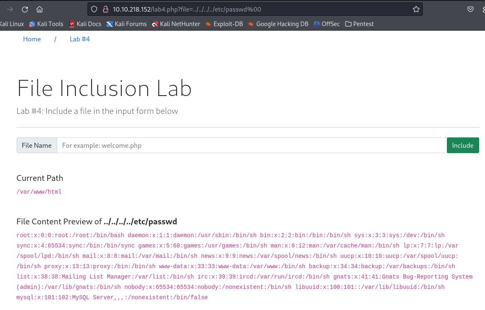

- **Lab 5**

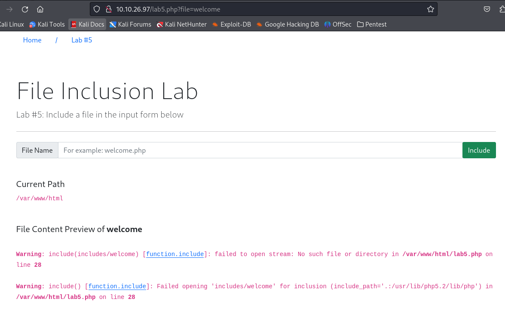

---

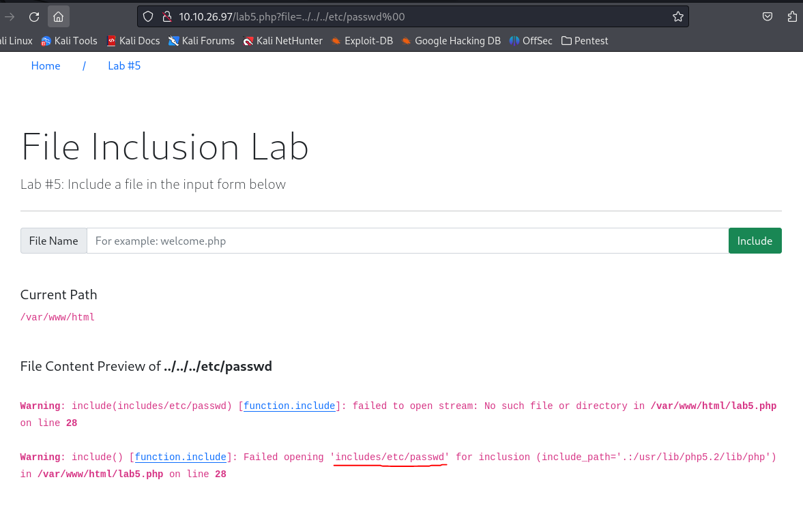

---

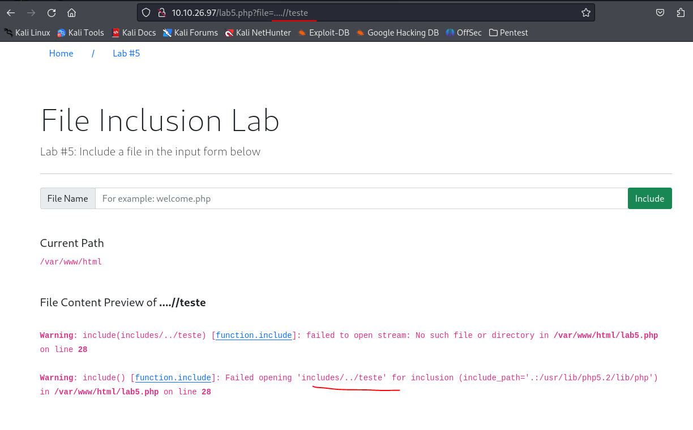

---

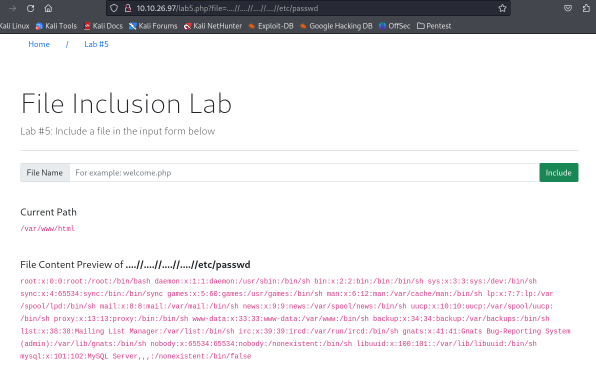

---

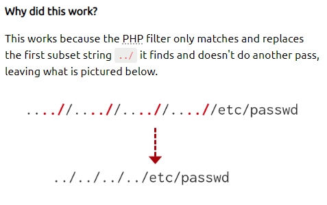

- **Lab 6**

---

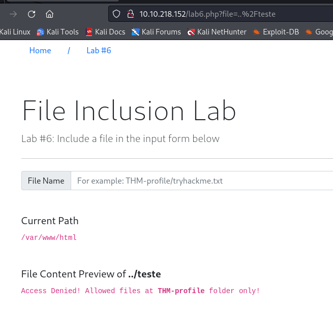

---

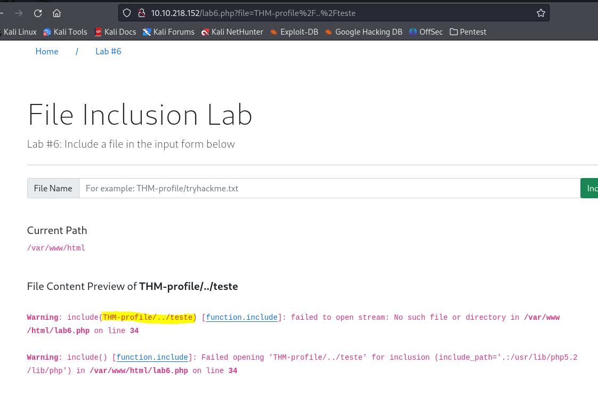

---

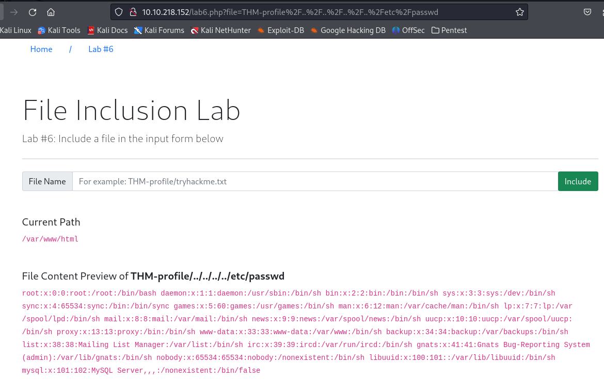

## Remote File Inclusion - RFI

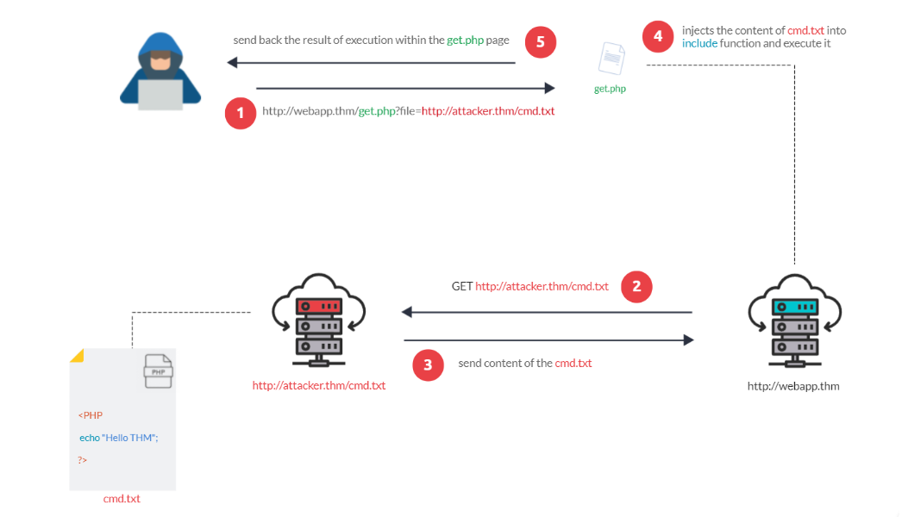

---

---

---

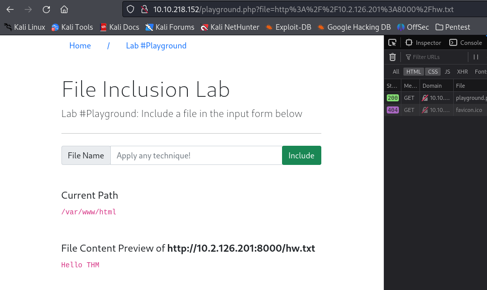
