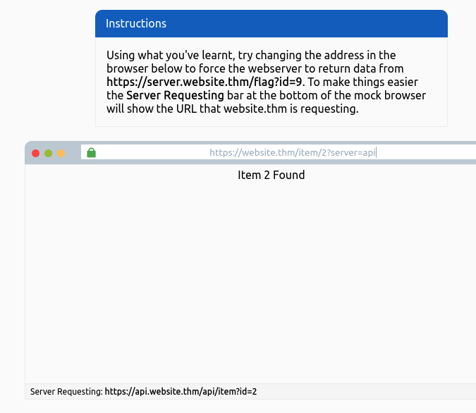
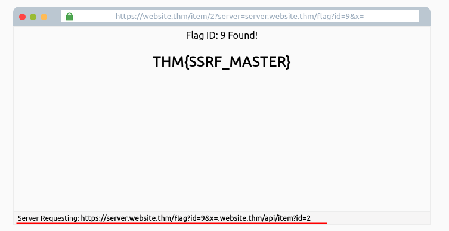
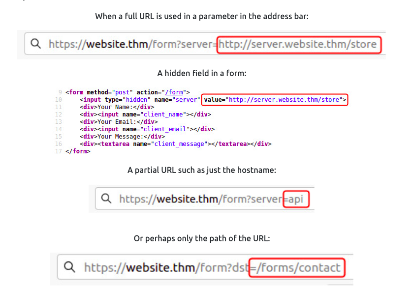

## What is an SSRF?

---

O SSRF (Server-Side-Request-Forgery) é uma vuln que permite que o atacante falsifique uma requisição do servidor alvo, essa falha acontece quando as requisições que o servidor faz não passar por sanitizações/escapes ou são validadas no back-end.

Temos 2 tipos de SSRF, ele pode basicamente retornar os dados de sua tentativa de SSRF, ou ele pode ser um Blind SSRF, isso significa que ele não retorna se teve sucesso ou não, ou qualquer mensagem de erro.

---

---

Podemos usar a sintaxe **"&arg="** para indicar que queremos ignorar toda a url desse ponto para frente.

## Finding an SSRF

Um SSRF pode estar em qualquer campo que seja um input de dado. Para lidar com blind SSRF vai ser necessario usar um external FTTP logging tool para monitorar as requisições.

Podemos usar o site requestbin.com, your own HTTP server or Burp Suite's Collaborator client.

---

## Defeating Common SSRF Defenses

-   **Deny list**

Basicamente uma black list, qualquer ip/dominio informado aqui não consegue se comunicar, um servidor web usa para proteger endpoints ou IP's sensiveis ao público como o localhost.

Aqui podemos trabalhar diferentes formas de representar o localhost, quem sabe o DEV esqueceu de escapar uma.

127.0.0.1, 0, 0.0.0.0, 0000, 127.1, 127._._.\*, 2130706433, 017700000001. Ou podemos apontar para um servidor DNS q resolve o IP 127.0.0.1 como 127.0.0.1.nip.io

Em um ambiente de nuvem podemos bloquear o ip 169.254.169.254, la podemos encontrar metadados do servidor e possivelmente informações confidenciais. Um invasor pode contornar isso registrando um subdomínio em seu próprio domínio com um registro DNS que aponta para o endereço IP 169.254.169.254.

-   **Allow list**

O oposto da deny list, aqui tudo que estiver fora da lista não é permitido

-   **Open Redirect**

Essa falha acontece quando uma parte do site redireciona o usuario sem validar a URL de forma adequada, possibilitando o SSRF.
