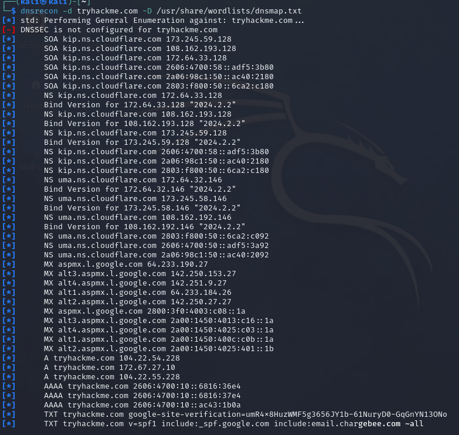
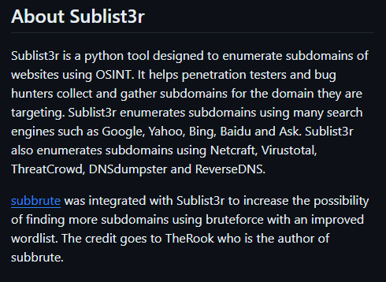
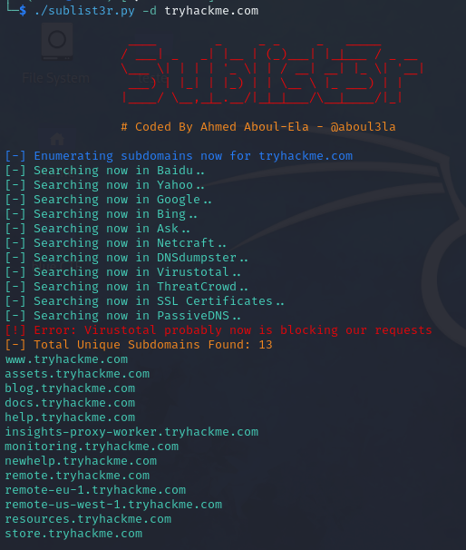

## Brief

---

A enumeração de subdomínios é a localização de subdominios válidos em um domínio, fazemos isso para aumentar a superfície de ataque.

Temos 3 métodos de enumeração de subdomínios:

- Brute Force
  .
- OSINT (Open-Source Intelligence)
  .
- Virtual Host

## OSINT - SSL/TLS Certificates

---

Quando um certificado SSL/TLS é criado para um dominio por uma CA (Certificate Authority), as CA's participam de um um Certificate Transparency (CT) logs, esses registros podem sser acessados publicamente, o objetivo dos logs é impedir o uso de certificados maliciosos.

https://crt.sh
https://ui.ctsearch.entrust.com/ui/ctsearc

## OSINT - Search Engines

---

Podemos usar um motor de busca para realizar esse processo de enumeração de um dominio, com o google podemos usar as famosas google dorks.

https://www.exploit-db.com/google-hacking-database

## DNS Bruteforce

---

Podemos usar scripts para rodar uma wordlist para enumerar DNS.




## OSINT - Sublist3r

---

https://github.com/aboul3la/Sublist3r





## Virtual Hosts

---

Alguns subdomínios não estão acessíveis publicamente, em vez disso é possivel estar em um servidor privado ou gravado na maquina.

```
/etc/hosts (ou arquivo c:\windows\system32\drivers\etc\hosts para usuários do Windows)
```

Esse arquivo mapeia nomes de domínio para endereços IP.

Como os servidores web podem hospedar vários sites de um servidor quando um site é solicitado a um cliente, o servidor sabe qual site o cliente deseja no cabeçalho Host. Podemos utilizar esse cabeçalho de host fazendo alterações nele e monitorando a resposta para ver se descobrimos um novo site.

```
ffuf -w /usr/share/wordlists/seclists/Discovery/DNS/namelist.txt -H "Host: FUZZ.acmeitsupport.thm" -u http://10.10.85.83
```

O comando acima usa a opção -w para especificar a lista de palavras que usaremos. A opção -H adiciona/edita um cabeçalho (neste caso, o cabeçalho Host), temos a palavra-chave FUZZ no espaço onde normalmente iria um subdomínio, e é aqui que tentaremos todas as opções da lista de palavras.

Como o comando acima sempre produzirá um resultado válido, precisamos filtrar a saída. Podemos fazer isso usando o resultado do tamanho da página com a opção -fs.

```
ffuf -w /usr/share/wordlists/seclists/Discovery/DNS/namelist.txt -H "Host: FUZZ.acmeitsupport.thm" -u http://10.10.85.83 -fs {size}
```
