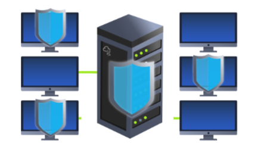

# Introduction to Defensive Security

---

A segurança defensiva é a contra parte da segurança ofensiva, enquanto a segurança ofensiva se concentra em tentar invadir o perimetro, a segurança defensiva se concentra em defender o perimetro, essa defesa é recomendada que seja feita em camadas, e algumas delas são:

- Treinamento do usuário sobre riscos ciberneticos.
- Documentar e gerenciar ativos, é preciso conhecer o sistema para proteger o mesmo.
- Atualização e aplicação de pathes para garantir que esteja utilizando sempre uma versão a mais atualizada e segura possível.
- Configuração de dispositivos de segurança como firewall e IPS. Os firewalls controlam o tráfego de rede que pode entrar e o que pode sair do sistema ou rede, já o IPS é usado para examinar os pacotes que entra e sai da sua rede, procurando assinaturas de possiveis atividades maliciosas podendo gerar logs ou ate mesmo derrubar o ataque.
- Configuração de dispositivos de registro e monitoramento.

### Areas of Defensive Security

---

Vamos abordar alguns tópicos importantes relacionado a segurança defensiva como: _Security Operations Center (SOC)_, _Digital Forensics and Incident Response (DFIR)_ e análise de malware.

**Security Operations Center (SOC)**
